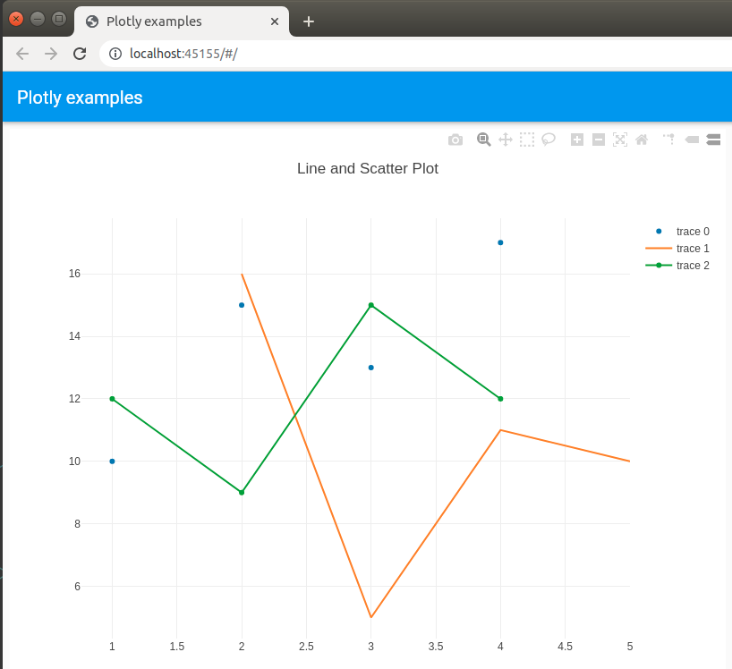

# flutter_web_plotly

Plotly for Flutter web

## Why
Flutter libraries for drawing charts are relatively immature as of mid 2021.  If
you are only targeting the web, a great solution is to use the feature full
[Plotly](https://plotly.com/javascript/) javascript library.


## Getting Started

See the example folder for usage.  



In your own project, inside your ```web/``` folder create a ```js/``` folder 
and copy the```plotly-latest.min.js```file inside.

Edit your ```index.html``` file and add
```
  <script defer src="main.dart.js" type="application/javascript"></script>
  <script src="js/plotly-latest.min.js"></script>
```
to your ```<head>``` element.


